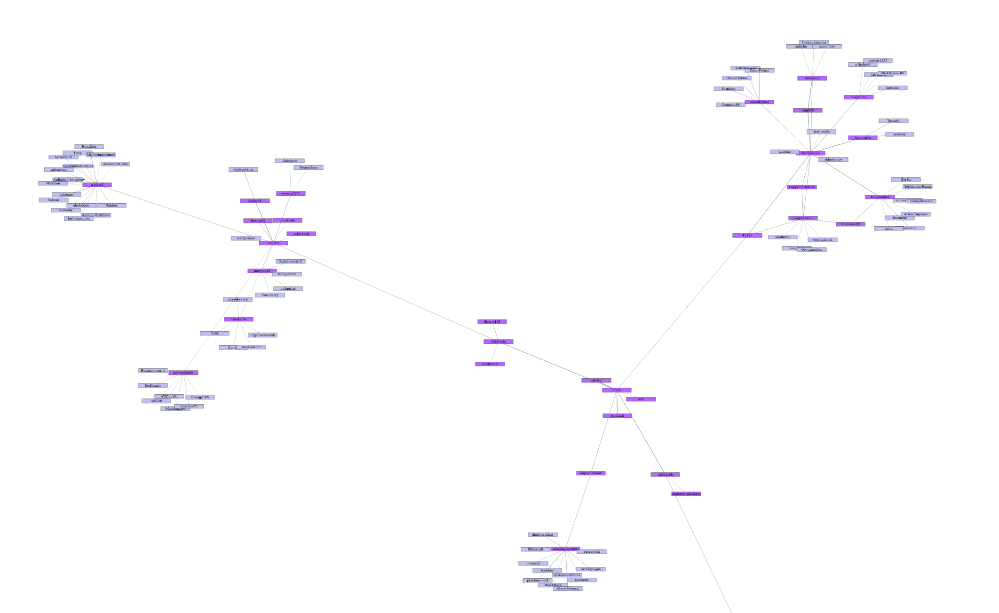

# GitHub Followers and Following Visualization

## Example Visualization

## Description

The above image shows an example visualization created using the project. Each node represents a user, and the lines connecting them represent followers and following relationships.

This project is designed to provide a dynamic and interactive way to visualize a GitHub user's followers and following using the GitHub API. The visualization is created using d3.js, a JavaScript library for producing dynamic, interactive data visualizations in web browsers. The backend is written in Python using Flask.

## Features

- Dynamic and interactive graph visualization of a user's followers and following on GitHub
- Real-time data fetching using GitHub API
- Easy to use and responsive interface
- Filter and search options to find specific users in the graph

